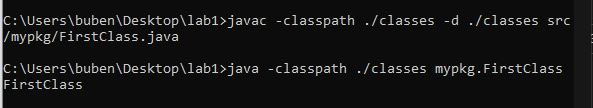
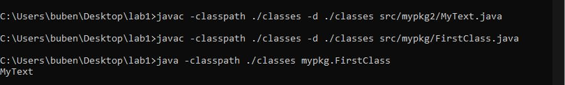
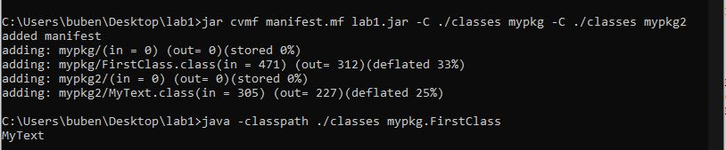

= Отчет по лабораторной работе 1 
Студентов группы ПИМ-21 Носкова И.А. Бубенцова С.А.
:example-caption: Структура
:listing-caption: Листинг
:source-highlighter: coderay

== 1 Постановка задачи
В процессе выполнения лабораторной работы необходимо выполнить следующие задачи:

. Создать исполняемый java класс, который выводит текстовую строку на экран.
. Разработать два класса. Первый класс выводит строку из второго класса.
. Создать jar-файл, хранящий элементы из предыдущего задания.

== 2 Разработка

=== 2.1 Структура проекта

.Структура проекта первого задания
===============
----
|-- src
|   `--mypkg
|      `-- FirstClass.java
`-- classes
    `-- mypkg
        `-- FirstClass.class
----
===============

.Структура проекта второго задания
===============
----
|-- classes
|   |-- mypkg
|   |   `-- FirstClass.class
|   |
|   `-- mypkg2
|       `-- MyText.class
`-- src
    |-- mypkg
    |   `-- FirstClass.java
    |
    `-- mypkg2
        `-- MyText.java
----
===============

.Структура проекта третьего задания
===============
----
|-- lab1.jar
|-- minifest.mf
|-- classes
|   |-- mypkg
|   |   `-- FirstClass.class
|   |
|   `-- mypkg2
|       `-- MyText.class
`-- src
    |-- mypkg
    |   `-- FirstClass.java
    |
    `-- mypkg2
        `-- MyText.java
----
===============

=== 2.2 Задание 1
Сначала были созданы необходимые дирректории.

.Создание директорий
----
mkdir src
mkdir classes
mkdir mypkg
----

Далее был создан исполняемый класс FirstClass.

.Листинг класса FirstClass
[source, java]
----
package mypkg;
public class FirstClass{
    public static void main(String args[]){
        System.out.println("FirstClass");
    }
}
----

Для компиляции файла в командной строке использовалась команда javac.

.Команда javac
----
javac -classpath ./classes -d ./classes src/mypkg/FirstClass.java
----

Для запуска файла в командной строке использовалась команда java.

.Команда java
----
java -classpath ./classes mypkg.FirstClass
----

При запуске скомпилированного файла в командной строке выводится строка "FirstClass".

=== 2.3 Задание 2
К уже созданным директориям была добавлена еще одна.

.Создание директории
----
mkdir mypkg2
----
В созданной директории был создан дополнительный класс MyText, хранящий текстовую строку "MyText". Для вывода нового сообщения класс FirstClass был изменен.

.Листинг класса MyText
[source, java]
----
package mypkg2;
public class MyText{
     public static String msg = "MyText";                               
}
----

.Листинг класса FirstClass
[source, java]
----
package mypkg;
import mypkg2.MyText; 
public class FirstClass{
    public static void main(String args[]){
        System.out.println(MyText.msg);
    }
}
----
Далее с помощью команды javac данные файлы были скомпилированы. Файл FirstClass был запущен командой java. При запуске программы в командной строке выводится строка "MyText".  

=== 2.3 Задание 3
Был создан файл manifest.mf, в котором указан главный исполняемый класс FirstClass. 

.Листинг Manifest.mf
[source, java]
----
Manifest-Version: 1.0
Created-By: 1.6.0_19 (Sun Microsystems Inc.)
Main-Class: mypkg.FirstClass

----

После этого была выполнена команда по сборке архива jar и запуск jar-файла. 

.Команда по сборке архива
----
jar cvmf manifest.mf lab1.jar -C ./classes mypkg -C ./classes mypkg2
----

.Команда запуска jar-файла
----
java -jar lab1.jar
----
При запуске архива в командной строке выводится строка "MyText".  

== 3 Результаты выполнения

В результате выполнения первого задания был получен класс FirstClass. При запуске выводится строка:

В результате выполнения второго задания были получены классы MyText и FirstClass. При запуске FirstClass выводится строка:

В результате выполнения третьего задания был получен jar-файл lab1.jar. При запуске jar-файла выводится строка:

== Вывод
В результате выполнения лабораторной работы мы узнали как из командной строки осуществлять: компиляцию классов, запуск проектов, создание jar-файла.

